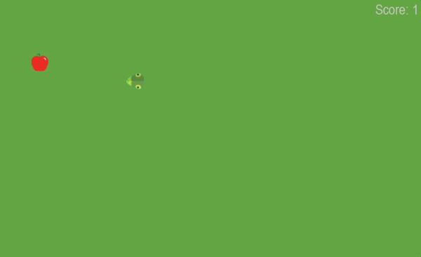
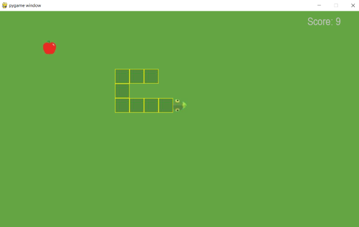
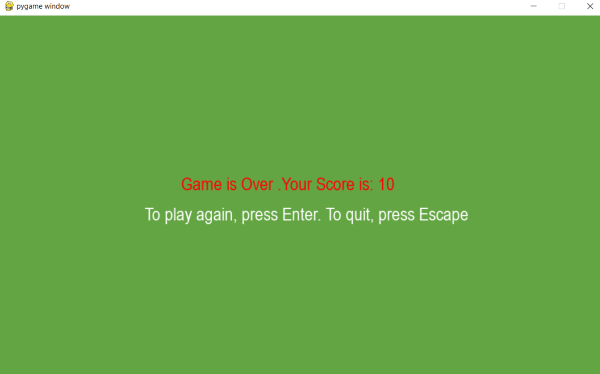

# Snake Game

This is a simple implementation of Snake Game.The resources are taken from [here](https://github.com/codebasics/python_projects/tree/main/1_snake_game/resources)

## Screenshots from the Game

## ToDo

1. Add an initial Welcome screen
2. Add pause functionality
3. Add no music or sound  functionality
